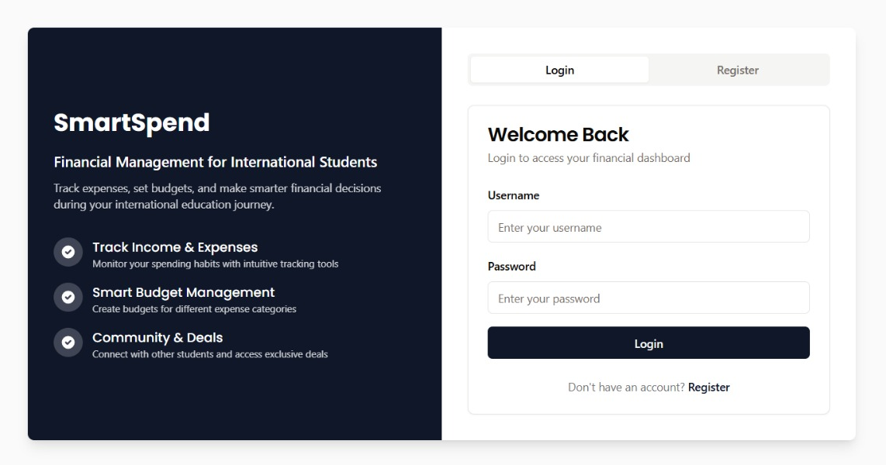
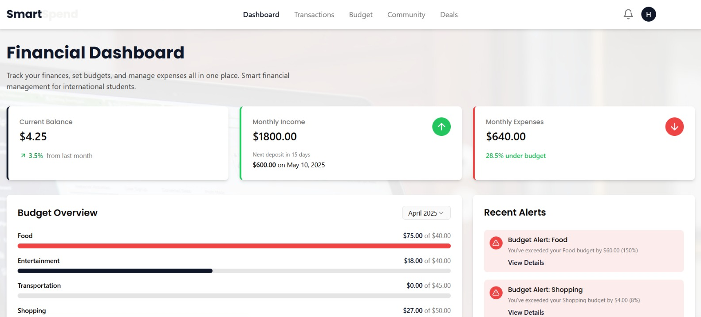
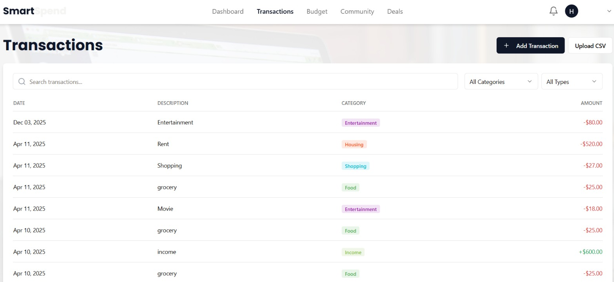
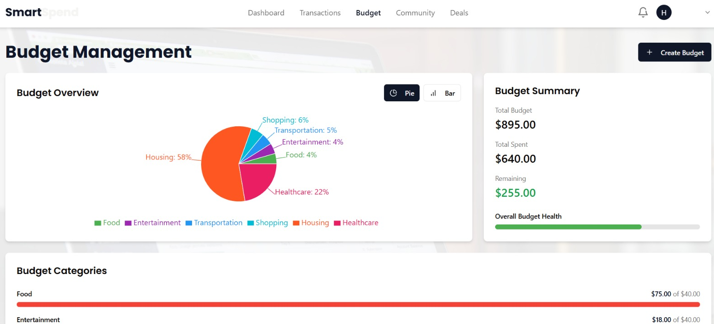
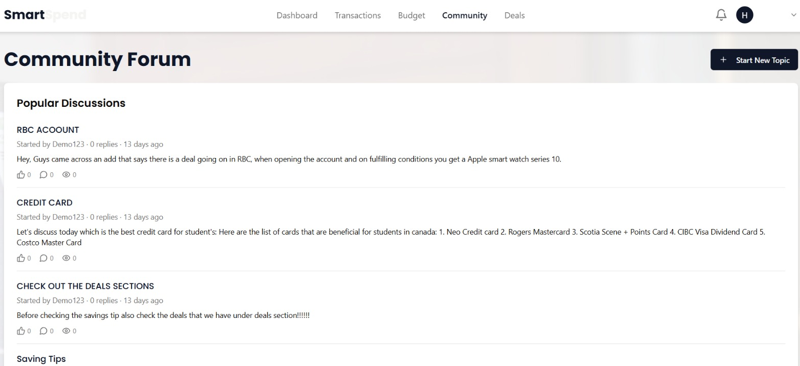
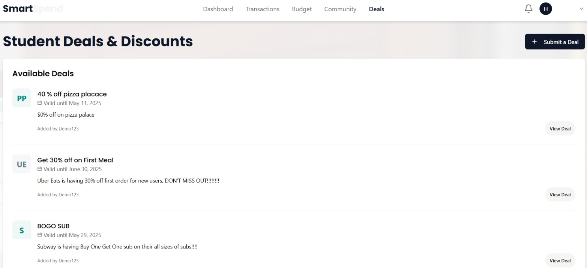

# Smart Spend - International Student Finance Management System

> Built with Replit, Deployed on Azure WebApp

Smart Spend is a comprehensive financial management application designed specifically for international students. It helps track expenses, manage budgets, and connect with the student community. This project was developed using Replit's collaborative development environment to learn about modern web application development, system integrations, and cloud deployment practices using Azure WebApp.

## Features

- **Financial Management**
  - Transaction tracking
  - Budget planning and monitoring
  - Income and expense categorization
  - CSV file import support

- **Community Features**
  - Student forum
  - Exclusive student deals
  - Community discussions
  - Budget tips sharing

- **User Management**
  - Secure authentication
  - Profile management
  - Multi-factor authentication support
  - Password reset functionality

## Development & Deployment

- **Development Environment**
  - Built on Replit's collaborative IDE
  - Real-time development and testing
  - Integrated version control

- **Cloud Deployment**
  - Deployed on Azure WebApp
  - Production-grade hosting
  - Automated deployment pipeline

## Tech Stack

- **Frontend**
  - React with TypeScript
  - Tailwind CSS
  - Shadcn UI components
  - React Query for state management

- **Backend**
  - Node.js/Express
  - TypeScript
  - PostgreSQL with Drizzle ORM
  - Passport.js for authentication

- **Cloud Infrastructure**
  - Azure App Service
  - Azure PostgreSQL
  - Azure Storage Account

## Getting Started

1. Install dependencies:
```bash
npm install
```

2. Start the development server:
```bash
npm run dev
```

The application will be available at `http://0.0.0.0:5000`

## Project Structure

```
├── client/            # Frontend React application
├── server/            # Backend Express server
├── shared/            # Shared types and schemas
└── public/            # Static assets
```

## Database Schema

- Users (Authentication and profile data)
- Categories (Transaction categories)
- Transactions (Financial transactions)
- Budgets (Budget settings)
- Alerts (User notifications)
- Forum Topics (Community discussions)
- Forum Replies (Discussion responses)
- Deals (Student offers)

## Features in Detail

### Financial Management
- Track income and expenses
- Set and monitor category-based budgets
- Import transactions via CSV
- View financial analytics and trends

### Community Features
- Participate in financial discussions
- Share and access student-specific deals
- Connect with other international students
- Access budgeting resources

### Security Features
- Secure password hashing
- Session management
- MFA support
- Rate limiting

## Contributing

1. Fork the repository
2. Create a feature branch
3. Commit your changes
4. Push to the branch
5. Open a pull request

## Screenshots

### Login Page

*Secure authentication with email and password*

### Dashboard

*Overview of finances with recent transactions and budget tracking*

### Transactions

*Detailed transaction history with filtering and CSV import*

### Budget Management

*Set and track category-wise budgets*

### Community Forum

*Connect with other students and share financial tips*

### Student Deals

*Access exclusive student deals and offers*

## License

MIT License
